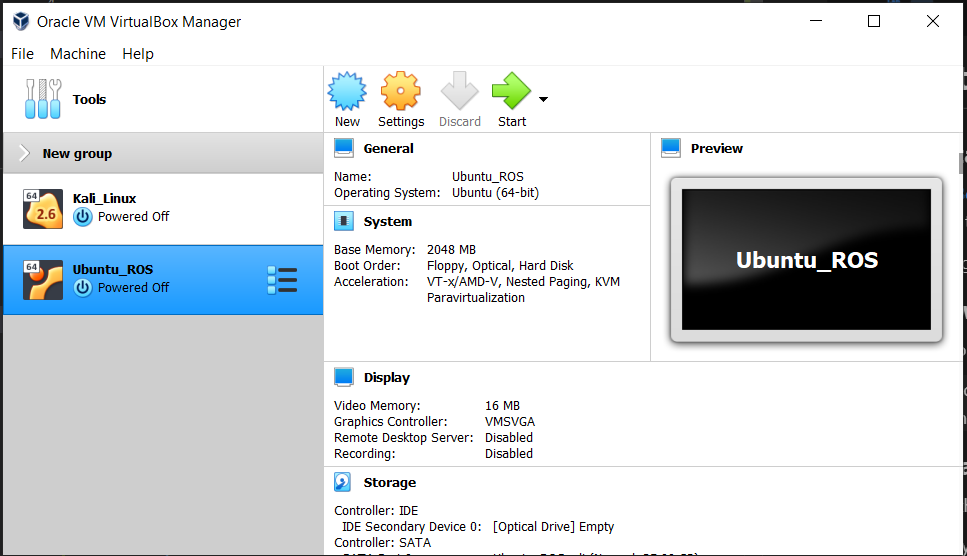
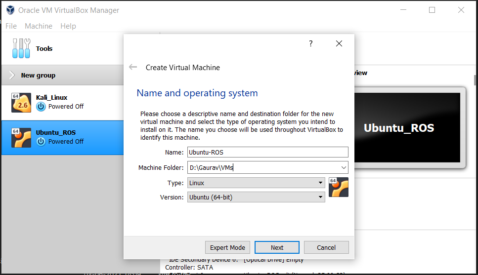
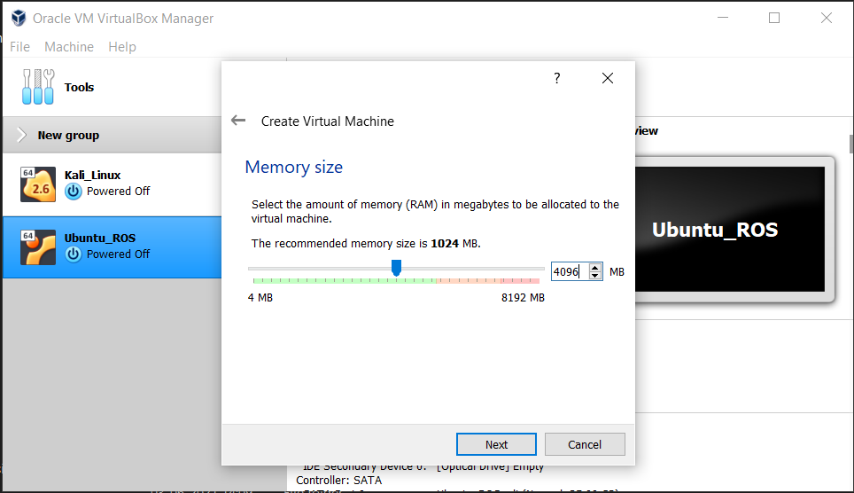
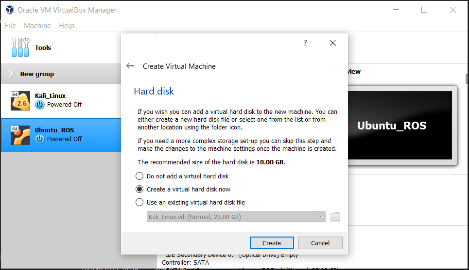
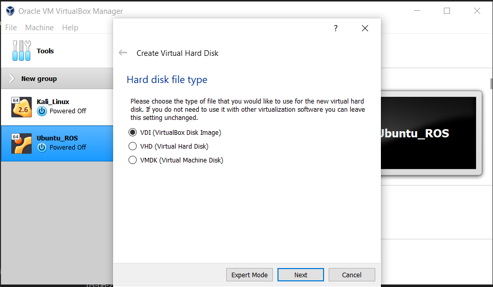
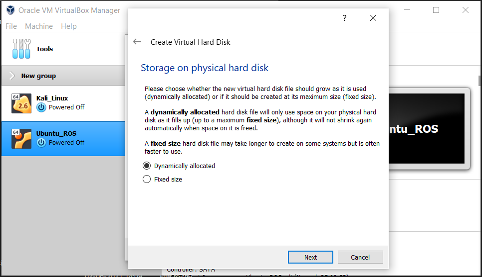
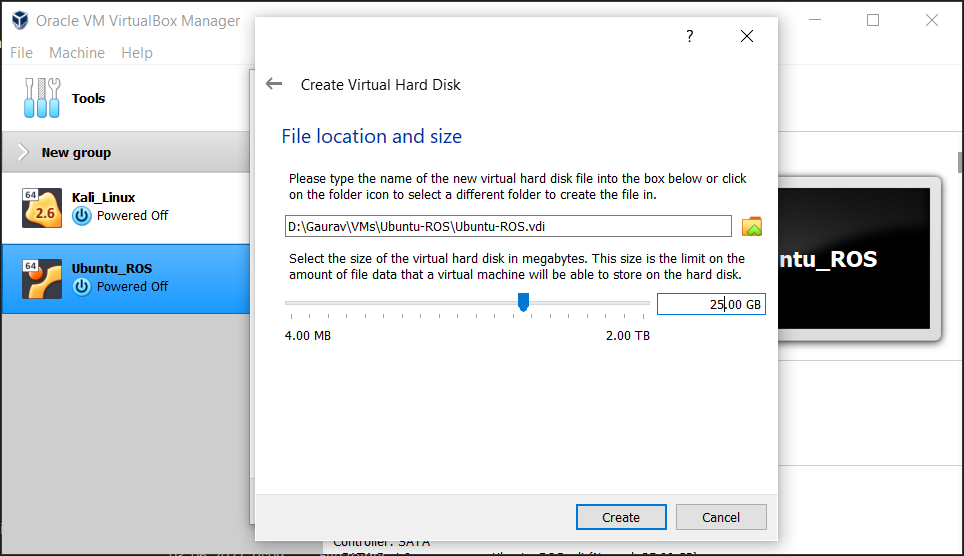
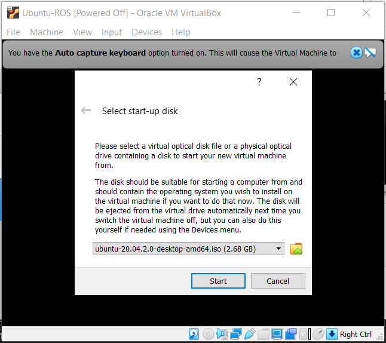
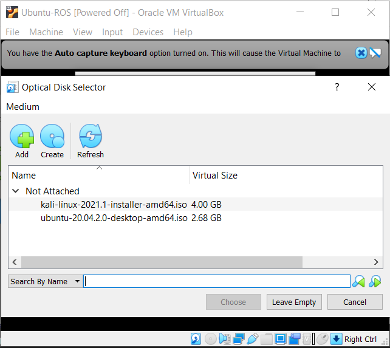

# **VM (Virtual Machine)**

## **Download**
The VM installation requires following files to be downloaded beforehand:  
1. [VirtualBox](https://www.virtualbox.org/wiki/Downloads) (If you are using windows operation system then download "Windows hosts" package from the website)
2. [Ubuntu 20.04 LTS Desktop](https://ubuntu.com/download/desktop) 
> If the download is slow (for Ubuntu 20.04 LTS Desktop) then use one of this Indian server links ([Link1](https://ubuntu-releases.hbcse.tifr.res.in/ubuntu-releases/focal/ubuntu-20.04.2.0-desktop-amd64.iso), [Link2](https://mirrors.piconets.webwerks.in/ubuntu-mirror/ubuntu-releases/20.04/ubuntu-20.04.2.0-desktop-amd64.iso), [Link3](http://ubuntu-releases.mirrors.estointernet.in/focal/ubuntu-20.04.2.0-desktop-amd64.iso)) to download it.

## **Install**

## **Step 1: Install VirtualBox**

> **If you haven't downloaded VirtualBox mentioned 1st in the Download section**: Go to the [VirtualBox Website](https://www.virtualbox.org/wiki/Downloads) and download it. (If you are using windows operation system then download "Windows hosts" package from the website)

After downloading the VirtualBox mentioned 1st in the **Download** section, double click to install it.

## **Step 2: Download Ubuntu Desktop file**

> **If you haven't downloaded Ubuntu 20.04 LTS Desktop file mentioned 2nd in the Download section**: Download the .iso file of "Ubuntu 20.04 LTS" from [Ubuntu Desktop](https://ubuntu.com/download/desktop). 
> If the download is slow then use one of this Indian server links ([Link1](https://ubuntu-releases.hbcse.tifr.res.in/ubuntu-releases/focal/ubuntu-20.04.2.0-desktop-amd64.iso), [Link2](https://mirrors.piconets.webwerks.in/ubuntu-mirror/ubuntu-releases/20.04/ubuntu-20.04.2.0-desktop-amd64.iso), [Link3](http://ubuntu-releases.mirrors.estointernet.in/focal/ubuntu-20.04.2.0-desktop-amd64.iso)) to download it.

## **Step 3: Create a new Virtual Environment**

Open VirtualBox that you installed in the first step. Click on **New** on the top.

Now, give it some name, select location whwre you want it to be saved and select Type as "Linux" and Version as "Ubuntu (64-bit)".

Now, it will ask for how much memory to allocate it. If you have 8 (or 8+) GB RAM in your PC then you can safely assign 4 GB Memory to the virtual machine. Only if you have less than 8 GB RAM in PC, assign 2 GB Memory to the virtual machine.

Click Next. In Hard Disk select "Create a virtual hard disk now".

Click "Create". Select "VDI (VirtualBox Disk Image)" in the next screen

Click "Next". Select "Dynamically allocated" in the next screen.

Click "Next". Choose a location where you want the virtual machine should occupy all the space. Assign 25 GB disk space to the virtual machine.

Click "Create". Now the virtual machine will be created and you will be able to see its icon in the left Menu. Select it and click on "Start".

Now, you have to select a disk file (the .iso file which we downloaded in the second step) for it to run.

If ypu can't see it in the options, click on the files icon. Then click on "Add" and add the .iso file that you downloaded in the second step then click on "Choose". Now, click "Start".

## **Step 4: Install Ubuntu in Virtual Machine**

It will take some time to start it. There will be some errors in the console, ignore them for now.

After it gets started, you will be asked to either "Test Ubuntu" or "Install Ubuntu". Select "Install Ubuntu" and it will install the Ubuntu 20.04 LTS in the virtual machine. (In the installation process choose default options. In the process there will an option selected "All the disk might get cleared while installation", here the disk space means the virtual 25 GB disk space that you assigned, not the disk space of windows operationg system. So, it will not affect the main memory)

**You have successfully installed and set up a Virtual Machine having Linux Environment.**

Now, we are ready to install ROS.

Go through the [ROS Installation](ROS.md) doc to install ROS.