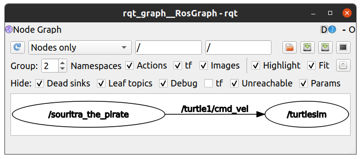

# **Creating a Publisher Node in Python**

After completing the tutorials on rostopics and creating a ROS package, you can try to build a publisher node in Python that will publish on the `/turtle1/cmd_vel`.
Lets check out the package we had created in the previous tutorial
```
+-- ~/catkin_ws/src/
|   +-- CMakeLists.txt
|   +-- ros_workshop/
|   |   +-- CMakeLists.txt
|   |   +-- package.xml
|   |   +-- include/
|   |   +-- src/
```
Proceed to create a new directory named `scripts` in the directory `~/catkin_ws/src/ros_workshop`
```
$ cd ~/catkin_ws/src/ros_workshop
$ mkdir -p scripts
```
So now our `ros_workshop` directory looks like
```
+-- ~/catkin_ws/src/
|   +-- CMakeLists.txt
|   +-- ros_workshop/
|   |   +-- CMakeLists.txt
|   |   +-- package.xml
|   |   +-- include/
|   |   +-- scripts/
|   |   +-- src/
```
We will place our Python scripts in this directory.

Now create a Python script in this directory and open a text editor to edit the script.
```
$ cd ~/catkin_ws/src/ros_workshop/scripts/
$ touch commander.py
$ gedit commander.py
```

We build a method to generate a publisher and run the publisher in a loop.
```
#!/usr/bin/env python

# Create ROS node to publish on the ROS Topic "/turtle1/cmd_vel"
# to direct the turtle to travel in a circle

# Gives you access to python methods for creating
# ROS nodes and publisher and subscribers
import rospy

# Import the data type / message type for subscribing / publishing to ROS Topic
from geometry_msgs.msg import Twist

# My main code will perform this method continuously
def talker():

    # Declaring a publisher object to publish to /turtle1/cmd_vel
    # The message type for the topic /turtle1/cmd_vel is Twist
    pub = rospy.Publisher("/turtle1/cmd_vel", Twist)

    # Creating a message template of Twist data class
    # for publishing to /turtle1/cmd_vel
    msg = Twist()
    
    # Initialize my ROS node
    rospy.init_node('souritra_the_pirate')
    
    # Object for maintaining the speed of the main while loop
    rate = rospy.Rate(10) # 10hz
    
    # Main while loop
    while not rospy.is_shutdown():
        
        # Building up my msg
        msg.linear.x = 1
        msg.angular.z = 1

        # Log
        rospy.loginfo("Publishing to /turtle1/cmd_vel")

        # Publish the message msg via our publisher object pub
        pub.publish(msg)
        
        # To maintain a 10 Hz loop rate
        rate.sleep()

try:
    
    talker()

except rospy.ROSInterruptException:
    
    pass
```
The comments alongside the code should be enough to understand the code. If you need help understanding the code, feel free to raise an issue or ask us on the discord server.

After creating this script file, you need to let ROS know that this script creates a ROS node and it is part of the package `ros_workshop`. For this we need to edit the `CMakeLists.txt` file in the `ros_workshop` directory.
```
$ cd ~/catkin_ws/src/ros_workshop/
$ gedit CMakeLists.txt
```
Append the following lines to the file `~/catkin_ws/src/ros_workshop/CMakeLists.txt`
```
# Mark executable scripts (Python etc.) for installation
# in contrast to setup.py, you can choose the destination
catkin_install_python(PROGRAMS
  scripts/commander.py
  DESTINATION ${CATKIN_PACKAGE_BIN_DESTINATION}
)
```
> In fact you may find these lines of code already present in the `CMakeLists.txt` but commented out in the `Install` section of the file.

Once you have edited and saved the `CMakeLists.txt`, go to `~/catkin_ws/` directory and build the node using the command `catkin_make`
```
$ cd ~/catkin_ws/
$ catkin_make
```

Finally lets run the node. As instructed in the previous tutorials, run the `roscore` and the `turtlesim_node` into two terminals, in a third terminal run the following command to run our node
```
$ rosrun ros_workshop commander.py
```
You will observe the turtlebot starts moving in a circle in the simulator. To stop the node press `Ctrl`+C.
To get a picture of how your different nodes are running you may use `rqt_graph` in a fresh terminal (all nodes should be running for this).
```
$ rqt_graph
```
It will open a window and display the following graph


As a final task, we want you develop a node that will work like the `turtle_teleop_key`. To see what it does, again start `roscore` and the `turtlesim_node` into two terminals. In a third terminal run the `turtle_teleop_key`
```
$ rosrun turtlesim turtle_teleop_key
```
You should now be able to control the turtlebot using the Up, Down, Left and Right arrow keys on your keyboard. To exit press `Ctrl`+C.
For the final task create a Python based node that will publish to `/turtle1/cmd_vel` topic upon pressing the W, A, S and D keys on the keyboard.
