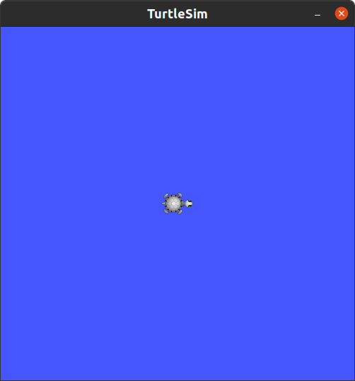
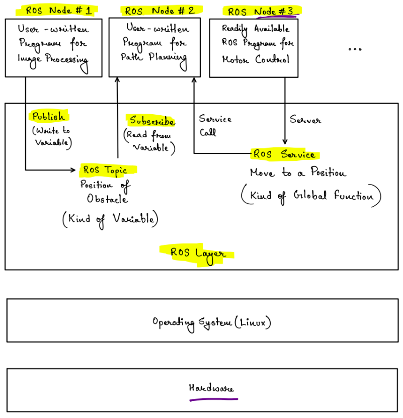

# **Playing with Turtlesim to Understand ROS Topics**

This tutorial assumes you have succesfully installed ROS on your Linux desktop.
Turtlesim is a very simplistic 2D robot simulator intended to understand and experiment with rostopics. To run the simulator, you need two terminals, one to start
the ros master node and second to start the turtlebot simulator node. Fire up a terminal and run
```
$ roscore
```
On another fresh terminal run
```
$ rosrun turtlesim turtlesim_node
```
This will open a small square window like one below,




You can think of the ROS master node set up by the `roscore` command to be the abstract layer shown in the figure below.



The ROS node `turtlesim_node` essentially provides the graphical output and simulates the movement of the turtle in the 2D plane.

Now, open another terminal and lets see how to communicate to the `turtlesim_node`. In the terminal use the `rostopic` command
```
$ rostopic list
```
This command will show the ROS Topics that are currently in use. To get a little more info on those topics, we can add the verbose option to the above command
```
$ rostopic list -v
```
Now, alongside each topic you will be able to see its message type and the number of publishers / subscribers to that topic.

Now lets checkout what is being published in those ROS topics using `rostopic echo`. Enter the following command to the terminal
```
$ rostopic echo /turtle1/pose
```
You will see the position and velocity of the turtle in the global coordinate frame continuously being published and printed on the screen.
To exit press `Ctrl`+C.

For the final part of this tutorial lets try publishing to the `/turtle1/cmd_vel/` topic. Publishing to this topic results in giving an initial velocity to the turtlebot you see on the screen. In another fresh terminal, after setting up `roscore` and `turtlesim_node`, type the following command
```
$ rostopic pub /turtle1/cmd_vel geometry_msgs/Twist "linear:
  x: 1.0
  y: 0.0
  z: 0.0
angular:
  x: 0.0
  y: 0.0
  z: 0.0"
```
While entering the above command you should not use the `Enter` key or newline character. If you simply keep on pressing `Tab` key after entering the rostopic, all the arguments appear automatically in the terminal. You just need to go to the `x` parameter using the right and left arrow keys on your keyboard and modify the values. If this does not appear automatically, you may also enter
```
$ rostopic pub /turtle1/cmd_vel geometry_msgs/Twist '[1.0, 0.0, 0.0]' '[0.0, 0.0, 0.0]'
```
Entering the above command results in the turtlebot moving in a straight line and then stopping (due to friction). You can try moving the turtlebot in x and y direction linearly or set an angular velocity along z direction. You will realise the velocity specified in the `/turtle1/cmd_vel/` topic is in the relative reference frame of the turtlebot. The following command will drive the turtlebot in circles
```
$ rostopic pub /turtle1/cmd_vel geometry_msgs/Twist  -r 1 '[1.0, 0.0, 0.0]' '[0.0, 0.0, 1.8]'
```
The additional argument `-r 1` keeps publishing the same message on `/turtle1/cmd_vel/` at a rate of 1 Hz. You can stop it by pressing `Ctrl`+C.

This is the end of this tutorial. Next you can try [creating a ROS package](tutorials/create_new_package.md) and in it create a publisher program in Python3.
